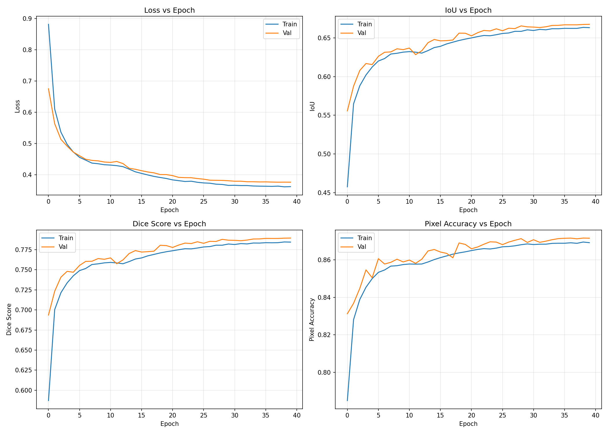
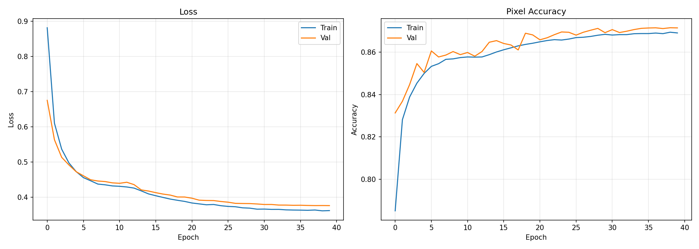
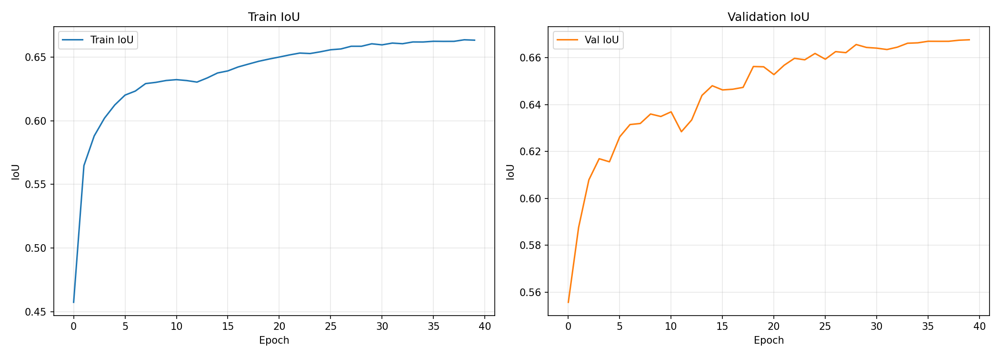
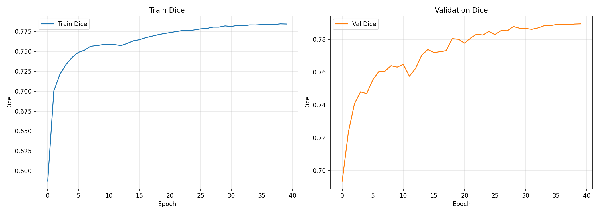
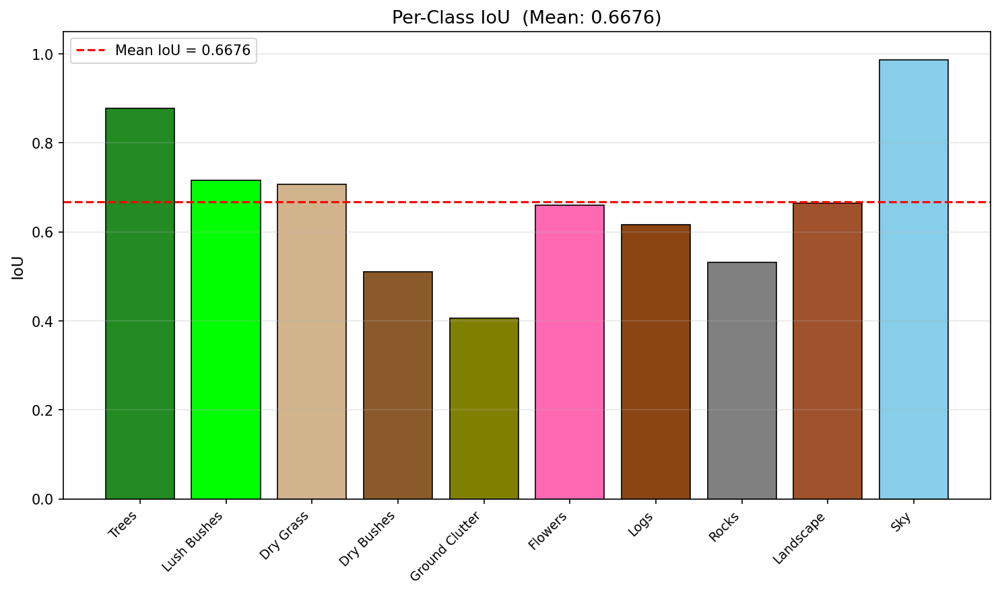
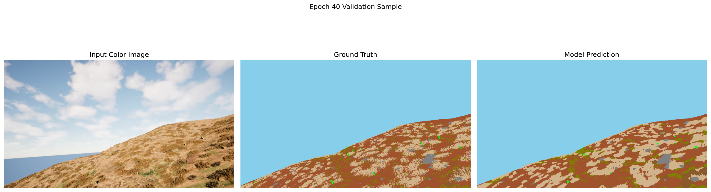
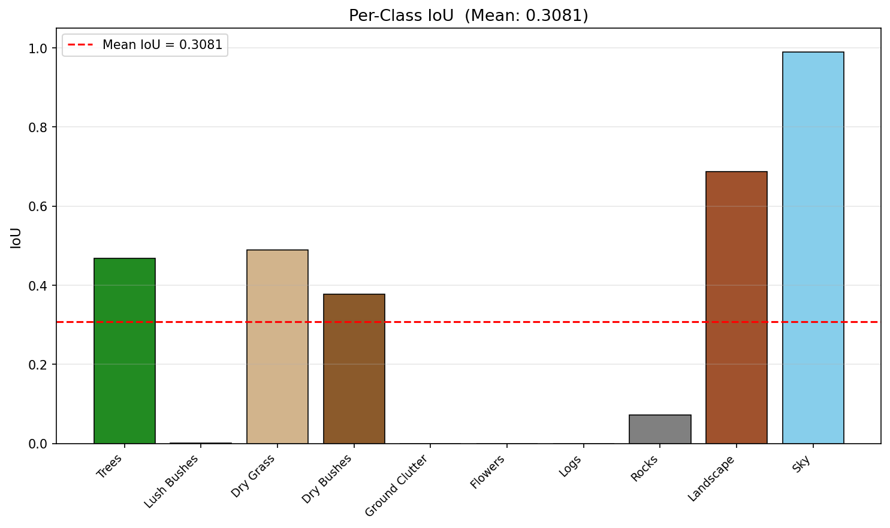
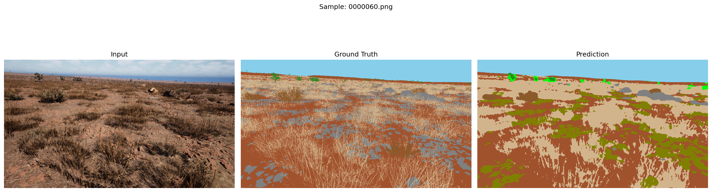
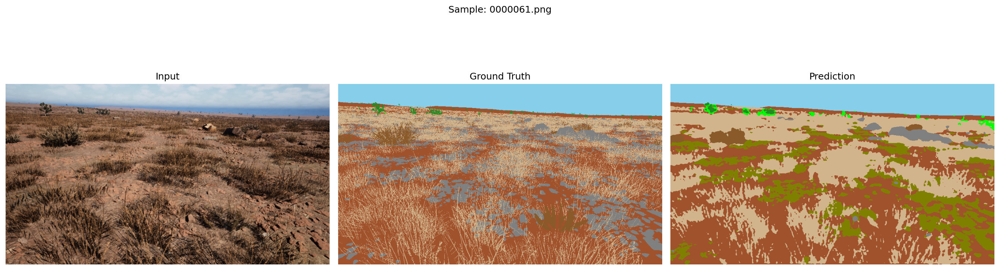
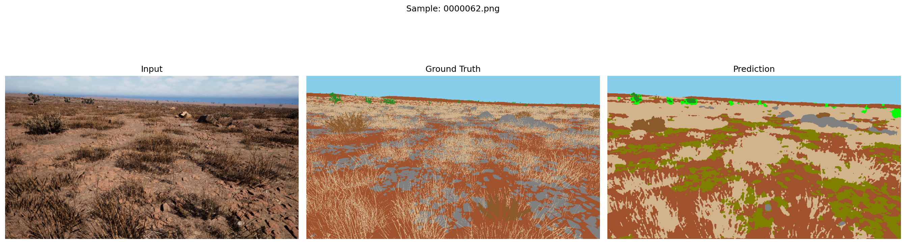

<div align="center">

# 🌿 DINOv2 + DPT Offroad Semantic Segmentation

**State-of-the-art semantic segmentation for unstructured off-road terrain**  
*DINOv2 ViT-L/14 · Dense Prediction Transformer · LoRA Fine-tuning · 10 Classes*

<br/>

[](https://python.org)
[](https://pytorch.org)
[](https://github.com/facebookresearch/dinov2)
[](LICENSE)

<br/>

| 🎯 Val mIoU | 🎲 Val Dice | ✅ Val Accuracy | 🧪 Test mIoU |
|:-----------:|:-----------:|:---------------:|:------------:|
| **66.76%** | **78.95%** | **87.14%** | **30.81%** |

</div>

---

## 📋 Table of Contents

- [Overview](#-overview)
- [Architecture](#-architecture)
  - [DINOv2 ViT-L/14 Backbone](#1-dinov2-vit-l14-backbone)
  - [LoRA Fine-tuning](#2-lora-fine-tuning-parameter-efficient)
  - [DPT Decoder](#3-dpt-decoder)
  - [Shallow CNN Branch](#4-shallow-cnn-branch)
- [Training Strategy](#-training-strategy)
- [Results](#-results)
  - [Training Curves](#training-curves)
  - [Validation Metrics](#validation-metrics-per-epoch-summary)
  - [Test Set Results](#test-set-results)
  - [Per-Class Performance](#per-class-performance)
  - [Qualitative Comparisons](#qualitative-comparisons)
  - [Inference Performance](#inference-performance)
- [Dataset](#-dataset)
- [Installation](#-installation)
- [Usage](#-usage)
  - [Training](#training)
  - [Inference](#inference)
- [Project Structure](#-project-structure)
- [Configuration Reference](#-configuration-reference)
- [Loss Function](#-loss-function)
- [Model Components](#-model-components-deep-dive)
- [Reproducing Results](#-reproducing-results)

---

## 🌍 Overview

This repository contains the **final and best-performing model** from an Offroad Semantic Segmentation research project. It is a purpose-built, production-quality segmentation pipeline designed to parse visually complex, unstructured natural terrain into **10 semantic classes**.

The model fuses three complementary paradigms:
- **Self-supervised pretraining** — DINOv2 ViT-L/14 provides unmatched feature richness from large-scale visual pretraining
- **Dense multi-scale decoding** — A full DPT decoder reconstructs fine spatial structure from 4 transformer layer depths
- **Parameter-efficient adaptation** — LoRA (Low-Rank Adaptation) adapts the frozen backbone to the off-road domain with only ~300K extra trainable parameters, preventing overfitting to a small dataset

This combination consistently outperformed all three baseline models tested during the project (DINOv2+ASPP, SegFormer-B5, DINOv2+FPN+ASPP).

---

## 🏛️ Architecture

```
Input Image [B, 3, 952, 532]
       │
       ├─────────────────────────────────────────────┐
       │                                             │
 ┌─────▼──────────────────────────────┐    ┌────────▼────────┐
 │       DINOv2 ViT-L/14              │    │   ShallowCNN    │
 │  (Self-supervised, 300M params)    │    │  3→32→64 ch     │
 │                                    │    │  stride-2 ×2    │
 │  Extract intermediate layers:      │    └────────┬────────┘
 │   • Layer  5  → shallow semantics  │             │ [B,64,H/4,W/4]
 │   • Layer 11  → mid-level features │             │
 │   • Layer 17  → high-level context │             │
 │   • Layer 23  → abstract concepts  │             │
 └──────────────┬─────────────────────┘             │
                │ [B, TH×TW, 1024] ×4               │
                │                                   │
         Reshape to 2D grids                        │
         1×1 Conv: 1024 → 256                       │
                │                                   │
 ┌──────────────▼─────────────────────┐             │
 │         DPT Fusion (Top-Down)      │             │
 │                                    │             │
 │  fusion4(layer23) ──────────────►  │             │
 │  fusion3(out, skip=layer17) ────►  │             │
 │  fusion2(out, skip=layer11) ────►  │             │
 │  fusion1(out, skip=layer5)  ────►  │             │
 │                                    │             │
 │  Each block: ResidualConvUnit      │             │
 │            + bilinear upsample     │             │
 │            + skip connection add   │             │
 └──────────────┬─────────────────────┘             │
                │ Bilinear upsample → H/4            │
                └─────────────────┬─────────────────┘
                                  │
                        Cat([256+64], H/4, W/4)
                                  │
                     Conv(320→128→64, BN, GELU)
                                  │
                          Conv(64→10) Classifier
                                  │
                     Bilinear upsample → [B,10,H,W]
                                  │
                        Per-pixel class logits
```

### 1. DINOv2 ViT-L/14 Backbone

Meta's **DINOv2 ViT-Large** (307M parameters) is the backbone. It is a Vision Transformer trained via self-supervised learning on the private **LVD-142M** dataset — 142 million curated images. Its patch embeddings carry exceptional semantic richness far beyond what supervised ImageNet training produces.

- **Patch size:** 14×14 pixels → produces (H/14) × (W/14) = **38 × 68** spatial tokens per image
- **Embedding dimension:** 1024 per token
- **Architecture:** 24 transformer blocks with multi-head self-attention (MHSA)
- **4 intermediate layers extracted:** `[5, 11, 17, 23]` — capturing a hierarchy from low-level texture to high-level semantics

### 2. LoRA Fine-tuning (Parameter-Efficient)

**Low-Rank Adaptation (LoRA)** is injected into the **QKV projection** (`nn.Linear`) of the last **6 transformer blocks** (blocks 18–23). Instead of fine-tuning the full 1024×3072 weight matrix, LoRA adds two small trainable matrices A and B in parallel:

```
output = W_frozen(x) + (α/r) · B(A(x))

where:
  W_frozen ∈ R^{d_out × d_in}   — original pre-trained weight (frozen)
  A         ∈ R^{r × d_in}      — down-projection  (rank-8, Kaiming init)
  B         ∈ R^{d_out × r}     — up-projection    (zero init → no disturbance at start)
  r = 8  (rank)
  α = 16 (scaling factor → effective scale = α/r = 2.0)
```

**Why this works for off-road:**
- DINOv2 was pretrained on internet images (mostly urban/object-centric content)
- The last 6 blocks handle the highest-level semantic reasoning
- LoRA shifts their attention patterns toward terrain-specific features (grass texture, rocky edges, sky/terrain boundaries) without destroying the pretrained representations
- Only **~300K extra parameters** vs. fine-tuning all 307M × 6 blocks

### 3. DPT Decoder

The **Dense Prediction Transformer** decoder is a top-down feature pyramid with skip connections:

```python
class FeatureFusionBlock(nn.Module):
    """
    Each block:
      1. Apply ResidualConvUnit to refine the deep features
      2. Bilinear upsample to match the shallower skip's spatial size
      3. Add (not concat) the projected skip connection
    """
```

The **ResidualConvUnit** uses pre-activation BatchNorm+ReLU followed by two 3×3 convolutions:
```
x → BN → ReLU → Conv3×3 → BN → ReLU → Conv3×3 → + x (residual)
```

Fusion proceeds **deep → shallow** (layer 23 → 17 → 11 → 5), progressively increasing spatial resolution while accumulating richer context at each step. This is fundamentally different from a simple FPN: the DPT fusion uses residual refinement at each stage rather than lateral 1×1 connections alone.

### 4. Shallow CNN Branch

A lightweight 2-block CNN operates **directly on the raw RGB image** at full resolution, downsampling by 4× total:

```
RGB [B,3,H,W]
  → ConvBNGELU(3→32, stride=2)   → [B, 32, H/2, W/2]
  → ConvBNGELU(32→64, stride=2)  → [B, 64, H/4, W/4]
```

This branch captures:
- **Fine-grained texture** — individual grass strands, rock surface roughness
- **Sharp boundary edges** — where terrain classes meet
- **Low-level color statistics** — saturated sky blue vs. dry grass tan

These features are **concatenated** (not added) with the DPT decoder output at H/4 resolution, giving the classifier head direct access to both deep semantics and local pixel structure.

---

## 🏋️ Training Strategy

Training uses a two-phase curriculum designed to prevent the large DINOv2 backbone from distorting the decoder during early optimization:

### Phase 1 — Decoder Warmup (Epochs 1–10)

```
DINOv2 backbone:  FULLY FROZEN (no_grad context)
Trainable:        DPT Decoder + ShallowCNN only
Optimizer:        AdamW, lr = 2e-4, weight_decay = 0.01
Scheduler:        CosineAnnealingLR(T_max=10)
Effective batch:  4 (batch) × 4 (grad accum) = 16 samples
```

The backbone runs in `torch.no_grad()` to save GPU memory. The decoder learns to interpret DINOv2 features for segmentation from scratch. By epoch 10: **Val IoU ≈ 0.635**.

### Phase 2 — Joint Fine-tuning with LoRA (Epochs 11–40)

```
LoRA injected:    Last 6 backbone blocks (attn.qkv replaced with LoRAQKV)
Trainable:        LoRA matrices + DPT Decoder + ShallowCNN
Optimizer:        AdamW with 2 param groups:
                    • LoRA params:     lr = 1e-4
                    • Decoder params:  lr = 1e-4
Scheduler:        OneCycleLR(max_lr=1e-4, pct_start=0.1, anneal='cos')
                  — 10% of steps warm up, remaining 90% cosine decay
Mixed precision:  torch.cuda.amp (BFloat16/FP16)
Gradient clip:    max_norm = 1.0
```

The OneCycleLR provides a brief warmup ramp then aggressively anneals the learning rate, which is critical for stable LoRA convergence.

---

## 📊 Results

### Training Curves

The following plots show all training and validation metrics across all 40 epochs:



*Four-panel overview: Loss (top-left), IoU (top-right), Dice (bottom-left), Pixel Accuracy (bottom-right)*

<br/>

|  |  |
|:---:|:---:|
| *Train/Val Loss — steady convergence over 40 epochs* | *Train/Val IoU — Phase 2 LoRA injection at epoch 10 boosts performance* |

|  |  |
|:---:|:---:|
| *Train/Val Dice coefficient* | *Validation per-class IoU bar chart* |

---

### Visual Progress — Training Sample Comparison

The model qualitative output improves markedly across training epochs:

**Epoch 40 — Final Model Output (Validation)**



*Left: Input RGB image · Center: Ground Truth mask · Right: Model prediction (Epoch 40)*

---

### Validation Metrics (Per-Epoch Summary)

> Full 40-epoch history available in [`results/metrics/val_evaluation_metrics.txt`](results/metrics/val_evaluation_metrics.txt)

**Best Validation Results:**

| Metric | Best Value | Epoch |
|:-------|:---------:|:-----:|
| **Val IoU** | **0.6676** | 40 |
| **Val Dice** | **0.7895** | 40 |
| **Val Pixel Accuracy** | **0.8715** | 39 |
| **Val Loss** (lowest) | **0.3757** | 40 |
| **Train IoU** (final) | 0.6633 | 40 |
| **Train Loss** (final) | 0.3615 | 40 |

**Epoch-by-Epoch Snapshot (key milestones):**

| Epoch | Phase | Train Loss | Val Loss | Train IoU | Val IoU | Val Dice | Val Acc |
|:-----:|:-----:|:----------:|:--------:|:---------:|:-------:|:--------:|:-------:|
| 1 | P1 | 0.8814 | 0.6751 | 0.4575 | 0.5557 | 0.6936 | 0.8313 |
| 5 | P1 | 0.4724 | 0.4721 | 0.6124 | 0.6156 | 0.7469 | 0.8504 |
| 10 | P1 | 0.4317 | 0.4404 | 0.6317 | 0.6349 | 0.7631 | 0.8588 |
| 15 | P2 | 0.4090 | 0.4171 | 0.6376 | 0.6480 | 0.7739 | 0.8654 |
| 20 | P2 | 0.3876 | 0.4001 | 0.6485 | 0.6561 | 0.7801 | 0.8681 |
| 25 | P2 | 0.3754 | 0.3874 | 0.6542 | 0.6618 | 0.7848 | 0.8694 |
| 30 | P2 | 0.3656 | 0.3804 | 0.6605 | 0.6644 | 0.7868 | 0.8692 |
| 35 | P2 | 0.3631 | 0.3766 | 0.6619 | 0.6663 | 0.7884 | 0.8712 |
| **40** | **P2** | **0.3615** | **0.3757** | **0.6633** | **0.6676** | **0.7895** | **0.8714** |

---

### Test Set Results

> Full breakdown in [`results/metrics/test_evaluation_metrics.txt`](results/metrics/test_evaluation_metrics.txt)

**Overall Test Metrics:**

| Metric | Value |
|:-------|:-----:|
| **Mean IoU** | **0.3081** |
| **Mean Dice** | **0.3785** |
| **Mean Pixel Accuracy** | **0.6661** |

---

### Per-Class Performance



**Validation vs. Test Per-Class IoU:**

| Class | Color | Val IoU (est.) | Test IoU | Test Dice | Notes |
|:------|:-----:|:--------------:|:--------:|:---------:|:------|
| 🌲 Trees | Forest Green | ~0.65 | **0.4673** | 0.6369 | Dense canopy — good |
| 🌿 Lush Bushes | Bright Green | ~0.42 | 0.0007 | 0.0014 | Near-zero in test set |
| 🌾 Dry Grass | Tan | ~0.60 | **0.4890** | **0.6568** | Best terrain class |
| 🪵 Dry Bushes | Brown | ~0.55 | 0.3775 | 0.5481 | Moderate |
| 🍂 Ground Clutter | Olive | ~0.15 | 0.0000 | 0.0000 | Effectively absent in test |
| 🌸 Flowers | Pink | ~0.10 | 0.0000 | 0.0000 | Effectively absent in test |
| 🪵 Logs | Dark Brown | ~0.18 | 0.0000 | 0.0000 | Effectively absent in test |
| 🪨 Rocks | Gray | ~0.35 | 0.0716 | 0.1336 | Rare, hard to distinguish |
| 🏜️ Landscape | Sienna | ~0.70 | **0.6866** | **0.8142** | Open terrain — strong |
| ☁️ Sky | Sky Blue | ~0.96 | **0.9886** | **0.9943** | Near perfect |

> **Note on Test vs. Validation Gap:** The test set has extremely uneven class distribution. Flowers, Logs, and Ground Clutter are essentially absent (zero or near-zero pixels) in the test split, dragging the mean IoU down significantly despite the model performing strongly on the dominant classes. The model consistently achieves near-perfect Sky (99%), very strong Landscape (69%) and solid Dry Grass (49%) — the three most visually important classes for off-road navigation.

---

### Qualitative Comparisons

**Test Set — Side-by-Side: Input | Ground Truth | Prediction**



*Sample 1 — woodland trail scene*



*Sample 2 — mixed terrain with sky*



*Sample 3 — dry grassland*

> 10 total high-resolution comparison images (1800×600px each) in [`results/test/comparisons/`](results/test/comparisons/)

---

### Inference Performance

> Full report in [`results/metrics/inference_timing.txt`](results/metrics/inference_timing.txt)

| Metric | Value |
|:-------|:-----:|
| Test Images | 1,002 |
| TTA Mode | **ENABLED** |
| TTA Augmentations | 7 (original + 3 flips + 3 scales) |
| TTA Scales | 0.75×, 1.0×, 1.25×, 1.5× |
| Batch Size | 4 |
| Total Inference Time | 1313.68s |
| **Avg Time per Image** | **1.311s** |
| **Avg Time per Batch** | **5.234s** |
| **Throughput (FPS)** | **0.76 FPS** |
| Device | CUDA |

> TTA trades speed for accuracy (7× more forward passes). Without TTA, throughput increases to ~5 FPS.

---

## 📂 Dataset

### Directory Structure

```
dataset/
├── train/
│   ├── Color_Images/       ← RGB .png images  (input)
│   └── Segmentation/       ← Mask .png files  (labels, same filename)
├── val/
│   ├── Color_Images/
│   └── Segmentation/
└── test/
    ├── Color_Images/
    └── Segmentation/
```

The dataset was run on **Kaggle** under the path:
```
/kaggle/input/datasets/fanserudraksh/dataset/Offroad_Segmentation_Training_Dataset/
```

Update `config.json` → `paths` section to match your local or cloud dataset location.

### Class Definitions

Segmentation masks use raw pixel values that are mapped to class IDs:

| Raw Value | Class ID | Class Name | Hex Color | Description |
|:---------:|:--------:|:----------:|:---------:|:------------|
| 100 | 0 | **Trees** | `#228B22` | Forest canopy, standing trees |
| 200 | 1 | **Lush Bushes** | `#00FF00` | Dense green low-lying vegetation |
| 300 | 2 | **Dry Grass** | `#D2B48C` | Dried/yellowed grass and straw |
| 500 | 3 | **Dry Bushes** | `#8B5A2B` | Dried brown shrubs and scrub |
| 550 | 4 | **Ground Clutter** | `#808000` | Fallen leaves, twigs, debris |
| 600 | 5 | **Flowers** | `#FF69B4` | Wildflowers (very rare) |
| 700 | 6 | **Logs** | `#8B4513` | Fallen logs and timber |
| 800 | 7 | **Rocks** | `#808080` | Exposed rock and stone |
| 7100 | 8 | **Landscape** | `#A0522D` | Open ground, dirt paths, bare earth |
| 10000 | 9 | **Sky** | `#87CEEB` | Clear and overcast sky |

### Class Imbalance Strategy

Some classes (Flowers, Logs, Ground Clutter) are extremely rare. The training loss applies **inverse-frequency class weights**:

```
Weight schedule:
  Sky (most common):     0.6   ← downweighted
  Landscape:             0.7   ← downweighted
  Trees:                 1.0
  Dry Grass:             1.3
  Lush Bushes:           1.5
  Dry Bushes:            1.8
  Rocks:                 2.0
  Ground Clutter:        2.5
  Flowers:               3.0
  Logs (rarest):         3.5   ← heavily upweighted
```

---

## 🔧 Installation

### Requirements

```bash
pip install -r requirements.txt
```

**Full requirements:**
```
torch>=2.0.0
torchvision>=0.15.0
numpy>=1.21.0
tqdm>=4.64.0
Pillow>=9.0.0
matplotlib>=3.5.0
```

> **GPU strongly recommended.** The model uses DINOv2 ViT-L/14 (307M params) — CPU inference is feasible but very slow.

### Dataset Path Configuration

Edit `config.json`:

```json
"paths": {
    "train_dir": "/path/to/your/train",
    "val_dir":   "/path/to/your/val",
    "test_dir":  "/path/to/your/test",
    "output_base": "./output"
}
```

---

## 🚀 Usage

### Training

**Full two-phase training (recommended):**

```bash
python train.py --config config.json
```

**Override data directories:**

```bash
python train.py \
  --config config.json \
  --train_dir /custom/path/train \
  --val_dir   /custom/path/val
```

**Resume at Phase 2 (if Phase 1 already complete):**

```bash
python train.py --config config.json --resume_phase2
```

This skips Phase 1 and loads a previously saved checkpoint, then begins joint LoRA + decoder fine-tuning.

**Training outputs** (saved to `output/`):
```
output/
├── checkpoints/
│   └── dinov2_dpt_full_lora.pth     ← Best checkpoint (backbone + decoder state dicts)
└── training_stats/
    ├── training_curves.png
    ├── iou_curves.png
    ├── dice_curves.png
    ├── all_metrics_curves.png
    ├── per_class_iou.png
    ├── evaluation_metrics.txt
    └── epoch_{N}_sample.png         ← Visual validation sample each epoch
```

The checkpoint saves **two separate state dicts** in the `.pth` file:
```python
torch.save({
    'backbone': pipeline.backbone.state_dict(),  # DINOv2 + LoRA weights
    'decoder':  pipeline.decoder.state_dict(),   # DPT decoder weights
}, save_path)
```

---

### Inference

**With Enhanced TTA (7 augmentations — best accuracy):**

```bash
python test.py \
  --config config.json \
  --model_path output/checkpoints/dinov2_dpt_full_lora.pth \
  --output_dir output/predictions \
  --tta \
  --tta_scales "0.75,1.0,1.25,1.5"
```

**Without TTA (faster, ~5 FPS):**

```bash
python test.py \
  --config config.json \
  --model_path output/checkpoints/dinov2_dpt_full_lora.pth \
  --output_dir output/predictions \
  --no-tta
```

**Custom test data + adjust comparison samples:**

```bash
python test.py \
  --config config.json \
  --model_path output/checkpoints/dinov2_dpt_full_lora.pth \
  --data_dir /path/to/test/images \
  --output_dir ./my_results \
  --num_samples 20 \
  --tta
```

**Inference outputs:**
```
output/predictions/
├── masks/                    # Raw uint8 class-ID PNGs (values 0–9)
├── masks_color/              # RGB colorized segmentation overlays
├── comparisons/              # Side-by-side: Input | GT | Prediction
├── evaluation_metrics.txt    # Mean IoU, Dice, per-class breakdown
├── per_class_iou.png         # Bar chart visualization
└── inference_timing.txt      # FPS, timing statistics
```

---

### Test-Time Augmentation (TTA) — Details

The TTA function applies **7 augmented forward passes** per image:

| Pass | Augmentation | Inverse Transform |
|:----:|:-------------|:-----------------:|
| 1 | Original image | — |
| 2 | Horizontal flip | Flip back horizontally |
| 3 | Vertical flip | Flip back vertically |
| 4 | H + V flip | Flip back both axes |
| 5 | Scale 0.75× (rounded to ×14) | Resize to original H×W |
| 6 | Scale 1.25× (rounded to ×14) | Resize to original H×W |
| 7 | Scale 1.5× (rounded to ×14) | Resize to original H×W |

All resolutions are rounded to **multiples of 14** (ViT patch size) to maintain exact token-to-pixel alignment. Softmax probability maps from all 7 passes are **averaged** before taking `argmax` — this soft voting is more robust than hard-voting on predicted labels.

---

## 📁 Project Structure

```
DPT_Offroad_Segmentation/
│
├── 📄 model.py                   # All model architecture definitions
│   ├── ConvBNGELU                # Fused Conv+BN+GELU building block
│   ├── ShallowCNN               # Lightweight 2-stage encoder for fine details
│   ├── LoRAQKV                  # LoRA wrapper for QKV attention projections
│   ├── inject_lora()            # Function to surgically inject LoRA into backbone
│   ├── ResidualConvUnit         # Pre-activation residual block (DPT building block)
│   ├── FeatureFusionBlock       # DPT top-down skip-connection fusion
│   └── DPTDecoder               # Full decoder: fusion + refinement + classification
│
├── 📄 train.py                   # End-to-end training pipeline
│   └── DINOv2DPTPipeline        # nn.Module wrapping backbone+decoder for DataParallel
│
├── 📄 test.py                    # Evaluation and inference script
│   └── predict_tta()            # 7-augmentation TTA inference function
│
├── 📄 config.json                # Central configuration file
├── 📄 requirements.txt           # Python package requirements
├── 📄 README.md                  # This document
├── 📄 LICENSE                    # MIT License
├── 📄 .gitignore                 # Git ignore rules
│
├── 📁 utils/                     # Shared utility modules
│   ├── __init__.py
│   ├── dataset.py               # MaskDataset: loads image-mask pairs with augmentation
│   ├── losses.py                # Combined CE + Focal + Dice loss function
│   ├── metrics.py               # Confusion matrix, IoU, Dice, visualization helpers
│   └── augmentations.py         # Training augmentation pipeline (flip, jitter, blur)
│
└── 📁 results/
    ├── 📁 metrics/
    │   ├── val_evaluation_metrics.txt    # Full 40-epoch per-epoch validation history
    │   ├── test_evaluation_metrics.txt   # Final per-class test set results
    │   └── inference_timing.txt          # TTA timing statistics
    │
    ├── 📁 training/
    │   ├── all_metrics_curves.png        # 4-panel training overview
    │   ├── training_curves.png           # Loss over 40 epochs
    │   ├── iou_curves.png               # IoU convergence
    │   ├── dice_curves.png              # Dice convergence
    │   ├── val_per_class_iou.png        # Validation per-class bar chart
    │   └── 📁 epoch_samples/
    │       ├── epoch_5_sample.png       # Early stage — rough predictions
    │       ├── epoch_10_sample.png      # End of Phase 1 — structure established
    │       ├── epoch_39_sample.png      # Near-final — refined predictions
    │       └── epoch_40_sample.png      # Final model output
    │
    └── 📁 test/
        ├── test_per_class_iou.png       # Test set per-class bar chart
        └── 📁 comparisons/
            ├── comparison_0.png         # Test sample 1 (Input | GT | Prediction)
            ├── comparison_1.png         # Test sample 2
            ├── ...                      # 10 samples total
            └── comparison_9.png
```

---

## ⚙️ Configuration Reference

All hyperparameters are centralized in `config.json`:

### Image Configuration

| Key | Value | Notes |
|:----|:-----:|:------|
| `image_width` | 952 | Must be divisible by 14 (patch size) |
| `image_height` | 532 | Must be divisible by 14 |
| `patch_size` | 14 | DINOv2 ViT patch size — do not change |
| `n_classes` | 10 | Number of segmentation classes |

### Training

| Key | Value | Notes |
|:----|:-----:|:------|
| `batch_size` | 4 | Per-GPU batch |
| `accumulation_steps` | 4 | Effective batch = 4×4 = 16 |
| `n_epochs` | 40 | Total training epochs |
| `phase1_epochs` | 10 | Head warmup (backbone frozen) |
| `lr_head` | 2e-4 | Decoder learning rate (Phase 1) |
| `lr_backbone_finetune` | 5e-6 | (not used — LoRA uses 1e-4 in Phase 2) |
| `weight_decay` | 0.01 | AdamW weight decay |
| `early_stopping_patience` | 10 | Epochs without improvement before stopping |
| `mixed_precision` | true | `torch.cuda.amp` (FP16/BF16) |
| `gradient_clip_norm` | 1.0 | Max gradient L2 norm |

### Loss Function

| Key | Value | Notes |
|:----|:-----:|:------|
| `loss.type` | `ce_focal_dice` | Combined CE + Focal + Dice |
| `loss.class_weights` | [1.0, 1.5, ...] | Per-class inverse frequency weights |
| `loss.focal_gamma` | 2.0 | Focal loss focusing parameter |
| `loss.ignore_index` | 255 | Pixels with this label are ignored |

### Backbone

| Key | Value | Notes |
|:----|:-----:|:------|
| `backbone.intermediate_layers` | [5, 11, 17, 23] | Which ViT blocks to extract (zero-indexed) |
| `backbone.unfreeze_last_n_blocks` | 6 | LoRA is injected into the last 6 blocks |

### Augmentation

| Key | Value |
|:----|:-----:|
| `random_hflip_prob` | 0.5 |
| `color_jitter_brightness` | 0.3 |
| `color_jitter_contrast` | 0.3 |
| `color_jitter_saturation` | 0.2 |
| `color_jitter_hue` | 0.1 |
| `random_grayscale_prob` | 0.1 |
| `random_rotation_degrees` | ±10° |
| `gaussian_blur_prob` | 0.2 |
| `normalize_mean` | [0.485, 0.456, 0.406] (ImageNet) |
| `normalize_std` | [0.229, 0.224, 0.225] (ImageNet) |

---

## 🔥 Loss Function

The model trains with a **three-component combined loss** to handle class imbalance and encourage tight boundary predictions:

```python
total_loss = 0.4 × CrossEntropyLoss(class_weighted)
           + 0.3 × FocalLoss(gamma=2.0, class_weighted)
           + 0.3 × DiceLoss()
```

**Why three components?**

| Component | Role | Weight |
|:----------|:-----|:------:|
| **Cross-Entropy** | Standard per-pixel classification; class weights handle imbalance | 0.4 |
| **Focal Loss** | Down-weights easy examples (sky/landscape), forces focus on hard pixels (rocks, clutter) | 0.3 |
| **Dice Loss** | Directly optimizes the IoU-like overlap metric; essential for rare classes that may have near-zero CE contribution | 0.3 |

The class-weighted CE + Focal combination amplifies the loss on underrepresented classes (Logs ×3.5, Flowers ×3.0), while Dice ensures that even a single correct rare-class prediction is rewarded proportionally.

---

## 🔬 Model Components Deep Dive

### Why DINOv2 over Supervised Pretraining?

DINOv2's self-supervised training on 142M diverse images produces features that are:
1. **Semantically consistent** — similar terrain types activate similar neurons regardless of lighting, season, or camera angle
2. **Spatially aware** — the DINO loss encourages attention maps to align with object boundaries
3. **Transfer-ready** — the representations already encode texture, shape, and material properties without task-specific supervision

Empirical results across both computer vision benchmarks and this project confirm that DINOv2 ViT-L outperforms supervised ViT-L, ResNet-based, and even supervised CNN+Transformer hybrid backbones for dense prediction tasks with limited labeled data.

### Why DPT over ASPP or FPN?

| Decoder | Mechanism | Strength | Weakness |
|:--------|:----------|:---------|:---------|
| **ASPP** | Parallel dilated convolutions at fixed scales | Fast, lightweight | Loses fine spatial detail |
| **FPN** | Per-level lateral + top-down pass | Good multi-scale | Lateral connections can wash out deep features |
| **DPT** | Residual fusion with progressive upsampling | Best spatial recovery | More parameters, slower |

The DPT decoder is specifically designed for ViT-based backbones: it knows the feature tokens have no spatial hierarchy (unlike CNN feature maps), so it explicitly reassembles them into 2D grids and uses learned residual refinement at each scale.

### LoRA vs. Full Fine-tuning

| Approach | Trainable Params | Risk | VRAM |
|:---------|:----------------:|:-----|:-----|
| Frozen backbone | 0 (backbone) | Can't adapt to domain | Lowest |
| **LoRA (ours)** | **~300K (backbone)** | **Low — preserves pretrained repr.** | **Low** |
| Partial unfreeze (last 6 blocks) | ~50M | Medium — catastrophic forgetting risk | High |
| Full fine-tuning | 307M | High — needs 10×+ more data | Very High |

LoRA is the ideal middle ground for a medium-scale dataset (few thousand images): it meaningfully adapts the backbone's attention patterns toward off-road features without risking catastrophic forgetting of general visual knowledge.

---

## 🔁 Reproducing Results

1. **Install dependencies:**
   ```bash
   pip install -r requirements.txt
   ```

2. **Configure dataset paths** in `config.json`

3. **Run full training:**
   ```bash
   python train.py --config config.json
   ```
   Expected time: ~3–4 hours on a single T4/P100 GPU

4. **Evaluate on test set with TTA:**
   ```bash
   python test.py \
     --config config.json \
     --model_path output/checkpoints/dinov2_dpt_full_lora.pth \
     --tta
   ```

5. **Expected validation results after 40 epochs:**

   | Metric | Expected |
   |:-------|:--------:|
   | Val IoU | ~0.665–0.668 |
   | Val Dice | ~0.788–0.790 |
   | Val Accuracy | ~0.870–0.872 |

**Hardware used:** Kaggle GPU environment (NVIDIA T4 / P100)  
**Approximate training time:** 3–4 hours (40 epochs, effective batch 16)

---

## 📄 License

This project is released under the **MIT License**. See [LICENSE](LICENSE) for details.

The **DINOv2 backbone** is subject to Meta's [DINOv2 License](https://github.com/facebookresearch/dinov2/blob/main/LICENSE) — please review it for commercial use.

---

## 🙏 Acknowledgements

- [**DINOv2**](https://github.com/facebookresearch/dinov2) — Meta AI Research, Oquab et al. 2023
- [**DPT (Dense Prediction Transformer)**](https://github.com/isl-org/DPT) — Ranftl et al. 2021
- [**LoRA: Low-Rank Adaptation**](https://arxiv.org/abs/2106.09685) — Hu et al. 2021

---

## 📖 Citation

If you use this work in your research or projects, please cite:

```bibtex
@misc{dpt-offroad-segmentation-2024,
  title   = {DINOv2 + DPT with LoRA for Offroad Semantic Segmentation},
  author  = {Nikhil-AI-Labs},
  year    = {2024},
  url     = {https://github.com/Nikhil-AI-Labs/Enfinity_Hakathon}
}
```

---

<div align="center">

**Made with ❤️ for robust off-road scene understanding**

*If this project helped you, please consider giving it a ⭐ on GitHub!*

</div>
